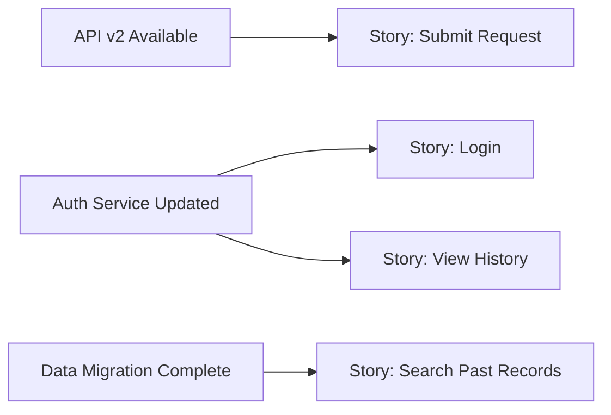

# Dependency Mapping

## When to Use

- Identifying what must exist or happen before the feature can be built or launched
- Mapping technical, organizational, and external dependencies
- Assessing whether dependencies have owners and realistic timelines
- Discovering hidden coupling that could delay delivery

## Procedure

### 1. Identify Dependencies

Examine user stories, scope definition, and architecture context to list everything the feature depends on:

| ID    | Dependency                    | Type                                         | Owner         | Status                                          | Required By                |
| ----- | ----------------------------- | -------------------------------------------- | ------------- | ----------------------------------------------- | -------------------------- |
| D-001 | _what the feature depends on_ | Technical / Organizational / External / Data | _who owns it_ | Available / In Progress / Not Started / Unknown | _which story or milestone_ |

**Dependency types:**

- **Technical** — APIs, services, libraries, infrastructure, environments
- **Organizational** — team availability, skills, approvals, budget allocation
- **External** — third-party services, vendor deliverables, regulatory approvals
- **Data** — data availability, data quality, migration, access permissions

### 2. Assess Risk per Dependency

| ID    | Dependency   | Likelihood of Delay (1–5) | Impact of Delay (1–5) | Risk Score | Mitigation              |
| ----- | ------------ | ------------------------- | --------------------- | ---------- | ----------------------- |
| D-001 | _dependency_ | _score_                   | _score_               | _product_  | _what to do if delayed_ |

Sort by risk score descending.

### 3. Map the Dependency Graph

Visualize which dependencies block which stories or milestones:

### 4. Identify the Critical Path

Trace the longest chain of dependencies to determine what controls the timeline:

| Step | Dependency / Story | Duration Estimate | Cumulative      |
| ---- | ------------------ | ----------------- | --------------- |
| 1    | _first blocker_    | _time_            | _running total_ |
| 2    | _next in chain_    | _time_            | _running total_ |

The critical path is the minimum timeline assuming no parallel work on the chain.

### 5. Save the Map

Write to `docs/design/requirements/<feature>/dependencies.md`.

## Output Format

1. Dependency inventory table with types, owners, and statuses
2. Risk assessment table with mitigation strategies
3. Mermaid dependency graph
4. Critical path analysis
5. Action items — dependencies with "Unknown" owner or "Not Started" status need immediate follow-up

## Rules

- Every dependency MUST have an owner — unowned dependencies are unmanaged risks
- "Unknown" status is a red flag, not an acceptable state — escalate immediately
- External dependencies deserve extra scrutiny — you cannot control their timeline
- Update the dependency map as statuses change — stale dependency maps create false confidence
- If a critical-path dependency is at high risk of delay, escalate to the Product Coach for scope or timeline adjustment
